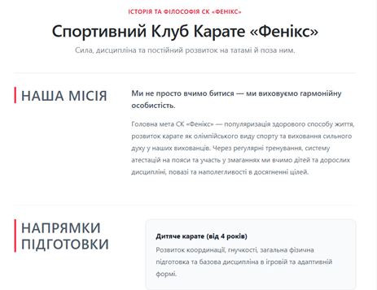
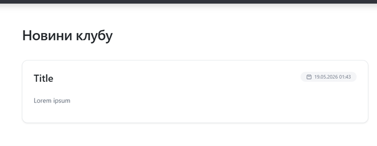
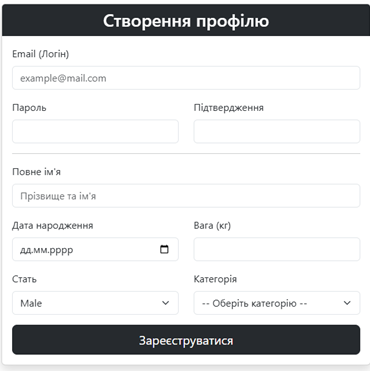
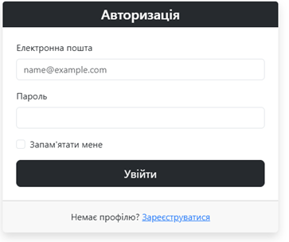
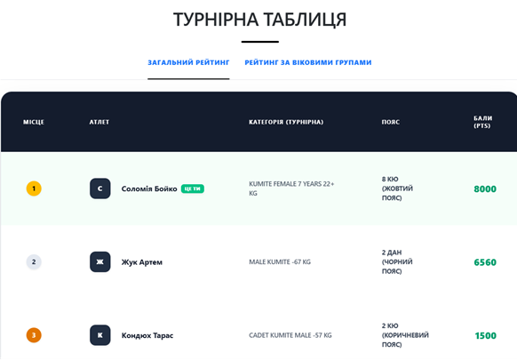
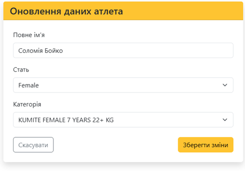
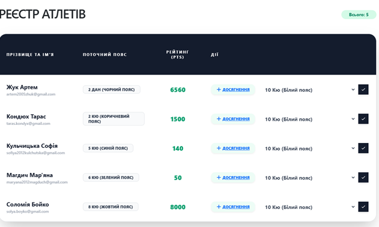

# PHOENIX

"Веб-застосунок інформаційної системи для відслідковування досягнень вихованців карате клубу "PHOENIX"."

---

## 👤 Автор

- **ПІБ**: Жук Артем
- **Група**: ФЕІ-41
- **Керівник**: Хвищун Іван, доцент, викладач кафедри радіофізики та комп'ютерних технологій
- **Дата виконання**: [31.05.2026]

---

## 📌 Загальна інформація

- **Тип проєкту**: Вебсайт
- **Мова програмування**: C# (ASP.NET Core + MVC)
- **Фреймворки / Бібліотеки**: Entity Framework Core, ASP.NET Core Identity, DataAnnotations, ASP.NET Core Authorization, Tailwind CSS

---

## 🧠 Опис функціоналу

- 🔐 Реєстрація та авторизація користувачів
- 🗒️ Створення, редагування, видалення досягнень та новини клубу з боку адміністратора
- 🥇 Відслідковування досягнень на основі яких формується рейтинг
- 💾 Збереження даних у базу даних PhoenixKarate.db
- 🌐 REST API для взаємодії між frontend та backend
- 📱 Адаптивний інтерфейс для користувача для ознайомлення з карате 

---

## 🧱 Опис основних класів / файлів

| Клас / Файл     | Призначення |
|----------------|-------------|
| `Program.cs`      | Точка входу програми |
| `PhoenixKarate.db`   | База даних |
| `tailwind.css` | Файл підключення Tailwind |
| `appsettings.json` | Налаштування додатку |
| `EnumExtensions` | Цей метод повертає текст із атрибута [Display] для елемента Enum, або його стандартну назву, якщо атрибута немає. |
| `Views\Shared\_Layout.cshtml` | Шаблон сторінок |
| `Views\Rating\Index.cshtml` | Файл для відображення сторінки рейтингу |
| `Views\News\Create.cshtml`| Файл для відображення сторінки для створення новин |
| `Views\News\Edit.cshtml`| Файл для відображення сторінки для редагування новин |
| `Views\News\Index.cshtml`| Файл для відображення сторінки з новинами |
| `Views\Home\Index.cshtml`| Файл для відображення головної сторінки |
| `Views\Home\Privasy.cshtml`| Файл для відображення сторінки з інформацією про карате там клуб |
| `Views\Admin\AddAchievement.cshtml`| Файл для відображення форми з можливістю додавати бали рейтингу та досягнення |
| `Views\Admin\Users.cshtml`| Файл для відображення сторінки з усіма користувачами |
| `Views\Account\EditProfile.cshtml`| Файл для відображення форми з можливістю редагувати профіль користувача |
| `Views\Account\Login.cshtml`| Файл для відображення форми з можливістю увійти в існуючий обліковий запис |
| `Views\Account\Profile.cshtml`| Файл для відображення профілю користувача |
| `Views\Account\Register.cshtml`| Файл для відображення форми реєстрації |
| `Controllers\AccountController.cs`| Цей контролер керує автентифікацією та обліковими записами користувачів |
| `Controllers\AdminController.cs`| Цей контролер забезпечує адміністративне керування системою |
| `Controllers\HomeController.cs`| Цей контролер відповідає за обробку та відображення головних сторінок |
| `Controllers\NewsController.cs`| Цей контролер відповідає за відображення новин, та додаванням, редагуванням та видаленням новин з боку адміністратора |
| `Controllers\RatingController.cs`| Цей контролер обробляє логіку оцінювання в системі |
| `Data\Configuration\CategoryConfiguration.cs`| Цей файл конфігурує сутність Category для Entity Framework Core, реалізуючи автоматичне заповнення бази даних початковими даними про категорії |
| `Data\SeedData\categories.json` | Список офіційних категорій |
| `Data\ApplicationDbContext.cs` | Цей файл визначає контекст бази даних |
| `Migrations` | Папка для зберігання міграцій |
| `Models\Achievement.cs` | Модель досягень |
| `Models\ApplicationUser.cs` | Модель користувача |
| `Models\Category.cs` | Модель категорії |
| `Models\News.cs` | Модель новин |
| `Interface\ICalculatePointsService.cs`| Інтерфейс для обчислення балів рейтингу |
| `Interface\ISportsmanValidation.cs`| Інтерфейс для валідації спортсменів |
| `Service\ICalculatePointsService.cs`| Сервіс для валідації спортсменів |
| `Service\ISportsmanValidationService.cs`| Сервіс для валідації спортсменів |

---

## ▶️ Як запустити проєкт "з нуля"

### 1. Встановлення інструментів

- Встановлення .NET
- Встановлення бібліотеки Entity Framework Core 
- Встановлення у Visual Studio ASP.NET Core

### 2. Клонування репозиторію

```bash
git clone https://github.com/Artemko09/PHOENIX
cd project-name
```

### 3. Запуск

#### Перший спосіб
- Ctrl + F5

#### Другий спосіб
- Прописати у консолі dotnet run

#### Третій спосіб
- За допомогою графічного інтерфейсу Visual Studio 
---

## 🖱️ Інструкція для користувача

1. **Головна сторінка** — вітання і кнопки:
   - `🔐 Увійти` — авторизація існуючого користувача
   - `📝 Зареєструватись` — створення нового профілю

2. **Після входу з боку користувача**:
   - Посилання `Рейтинг` відкриває доступ до сторінки рейтингу
   - Посилання `Новини` відкриває доступ до сторінки рейтингу
   - Посилання `*Ім'я користувача*` відкриває доступ до профілю користувача та його редагування певної інформації

3. **Після входу з боку адміністратора**:
   - Посилання `Рейтинг` відкриває доступ до сторінки рейтингу
   - Посилання `Новини` відкриває доступ до сторінки рейтингу та дає можливість додавати, видаляти та редагувати новини
   - Посилання `*Ім'я користувача*` відкриває доступ до профілю користувача та його редагування певної інформації
   - Посилання `Спортсмени` відкриває доступ до списку користувачів та для змін їхньої певної інформації 

4. **Інші функції**:
   - `🚪 Вийти` — завершує сесію користувача

---

## 📷 Приклади / скриншоти

- Головна сторінка
  


- Сторінка "Про нас"
  


- Сторінка новин
  


- Форма створення профілю



- Форма авторизації



- Рейтиг



- Профіль користувача


- Форма оновлення даних користувача



- Створення публікації


- Реєстр атлетів



- Додавання рейтингу


---

## 🧾 Використані джерела / література

- Microsoft. .NET fundamentals 
- Metzgar, D. .NET Core in Action. 
- Microsoft. C# guide 
- Lock, A. ASP.NET Core in Action: Third Edition. 
- Microsoft. Entity Framework Core 

---
